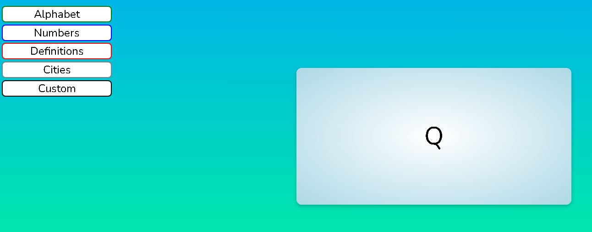
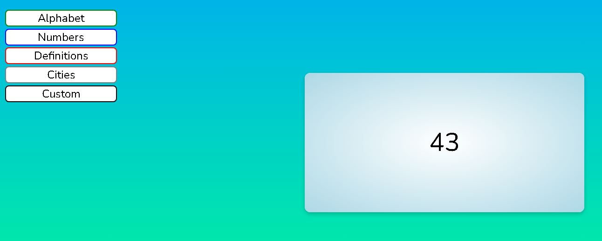
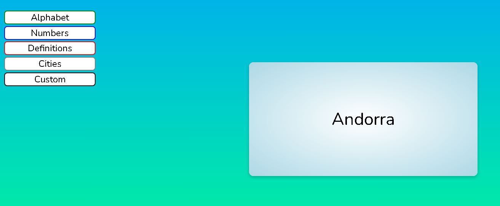
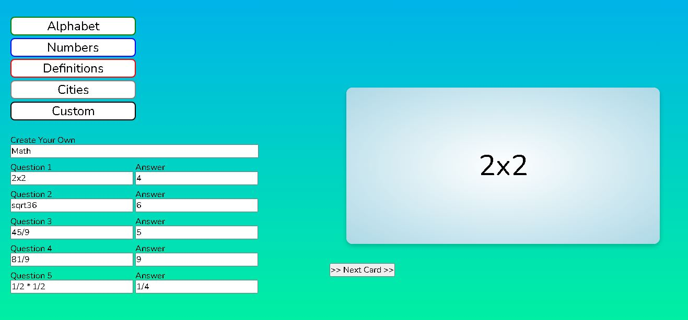

# Flashcard App
For kids, learning through flashcards is a great way to simplify and present information. Our flashcard set teaches the alphabet, numbers, word definitions, and even includes the ability to create custom flashcards.

## Table of contents
* [How it works](#how-it-works)
* [API's](#apis-used)
* [WireFrame](#wireframe)
* [Preview](#preview)
* [Flashcard](#flashcard-page)
* [Functions](#functions)
* [Future Features](#future-features)
* [Collaborators](#collaborators)

## How it Works
Users can click a button that contains the topic they want to learn. This will load the flashcard deck that the user can click through to hear the content of the flashcard and flip to see the answer. This simple functionality keeps users easily engaged and able to learn a mulitutde of topics rather easy.

## APIs Used
WordsAPI: https://rapidapi.com/dpventures/api/wordsapi/
    - Words API retrieves information about English words, including definitions, synonyms, rhymes, pronunciation, syllables, and frequency of usage. This API serves as our library of teachable concepts.

GeoDB Cities API: https://rapidapi.com/wirefreethought/api/geodb-cities/
    - GeoDB has an extensive amount of data on global cities, states, countries, and regions. This allouwed us to create our most challenging deck: flashcards on cities and their capitals.

## WireFrame

Our original wireframe includes a header, aside, and body section. Our aside serves as the menu for topics and custom cards. Our main section displays the current flashcard with the option to flip through its question and answer.
For this Project we will be using these three main front end languages HTML, CSS, JavaScript
- HTML - this is the markup language for our document to be displayed on the web browser
- CSS - this is the language we use to style an HTML document as well as describes how HTML elements should be displayed.
- JavaScript - this  is a scripting language that enables you to create dynamically updating content, control multimedia, animate images, and pretty much everything else

## Preview

## Flashcard Page

# Functions
- Alphabet - returns a leter either in upper or lower case formatting

- Numbers - returns a random number 1-100

- Definitions - returns a word on the front of the card with the definition of the word on the back from the API

- Cities - returns a random city from the API

- Custom - Ability to generate new cards with questions and answers with the use of the form function

## Future Features

With this project currently being about proof of concept, future deployments may include more features. These features may include a more detailed cirriculum and even miscellaneous categories like famous movies and their quotes.

# Collaborators
- Stephen Totten (https://github.com/Crothos)
- Ryan Damron (https://github.com/RyanDamron)
- Jared Gibson (https://github.com/jared-GG747)
- Holden Claus (https://github.com/HoldyClaus)
